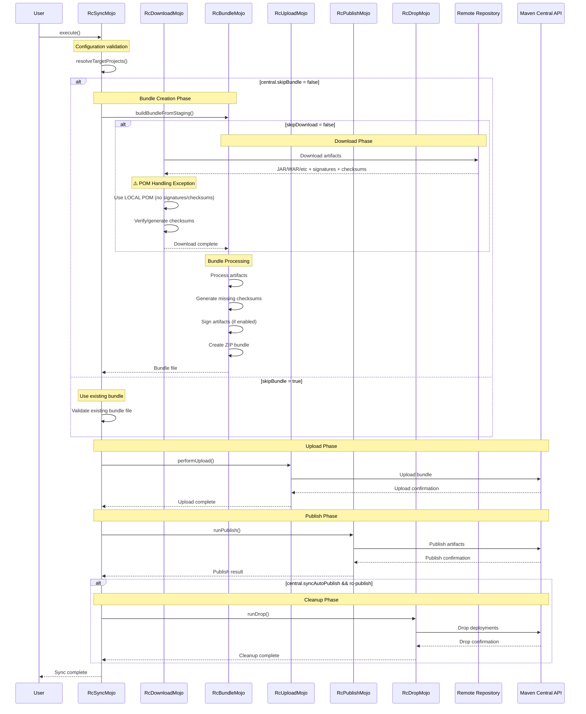

<!--
    Copyright (c) 2025 Eclipse Foundation and contributors.
    This program and the accompanying materials are made available under the terms of the Eclipse Public License v. 2.0
    which is available at https://www.eclipse.org/legal/epl-2.0/
    SPDX-License-Identifier: EPL-2.0
-->

# Maven Central Staging Plugin

A comprehensive Maven plugin for managing artifact synchronization to Maven Central through the Sonatype Central Portal API ([API Doc](https://central.sonatype.com/api-doc)), providing a complete workflow from download to publication.

- [Maven Central Staging Plugin](#maven-central-staging-plugin)
  - [Overview](#overview)
  - [Features](#features)
  - [Plugin Parameters](#plugin-parameters)
  - [Plugin Goals](#plugin-goals)
  - [Manual Execution Examples](#manual-execution-examples)
    - [Quick Examples](#quick-examples)
    - [Full Manual Workflow](#full-manual-workflow)
  - [Individual Goal Usage](#individual-goal-usage)
    - [rc-download](#rc-download)
    - [rc-bundle](#rc-bundle)
    - [rc-upload](#rc-upload)
    - [rc-publish](#rc-publish)
    - [rc-drop](#rc-drop)
    - [rc-list](#rc-list)
    - [rc-status](#rc-status)
  - [Plugin Parameters](#plugin-parameters-1)
    - [Core Configuration Parameters](#core-configuration-parameters)
    - [Repository Configuration Parameters](#repository-configuration-parameters)
    - [Execution Control Parameters](#execution-control-parameters)
    - [Artifact Processing Parameters](#artifact-processing-parameters)
    - [Validation Parameters](#validation-parameters)
    - [Drop Configuration Parameters](#drop-configuration-parameters)
    - [File and Directory Parameters](#file-and-directory-parameters)
  - [Creating an Artifact Bundle for Upload](#creating-an-artifact-bundle-for-upload)
    - [Bundle Structure Example](#bundle-structure-example)
    - [Required Artifacts](#required-artifacts)
    - [Deployment States](#deployment-states)
    - [Bundle Creation Process](#bundle-creation-process)
  - [rc-sync Goal Workflow](#rc-sync-goal-workflow)
    - [Complete Orchestration Process](#complete-orchestration-process)
      - [rc-sync Parameters](#rc-sync-parameters)
    - [rc-sync Task Flow and Sequence](#rc-sync-task-flow-and-sequence)
    - [rc-sync Usage Examples](#rc-sync-usage-examples)
      - [Complete Release Workflow](#complete-release-workflow)
      - [Using a Reactor Project](#using-a-reactor-project)
      - [Retry Failed Upload](#retry-failed-upload)
      - [Testing](#testing)
  - [Authentication Setup](#authentication-setup)
  - [GitHub Actions Integration](#github-actions-integration)
  - [Troubleshooting](#troubleshooting)
    - [Common Issues](#common-issues)
      - [Authentication Failures](#authentication-failures)
      - [Bundle Upload Failures](#bundle-upload-failures)
    - [Debug Mode](#debug-mode)
    - [Cleanup Failed Deployments](#cleanup-failed-deployments)
  - [FAQ](#faq)
    - [Q: Do I need to sign artifacts?](#q-do-i-need-to-sign-artifacts)
    - [Q: Can I unpublish artifacts?](#q-can-i-unpublish-artifacts)
    - [Q: What's the difference between `rc-sync` and individual goals?](#q-whats-the-difference-between-rc-sync-and-individual-goals)
    - [Q: Can I use this with private repositories?](#q-can-i-use-this-with-private-repositories)
    - [Q: How do I handle multi-module projects?](#q-how-do-i-handle-multi-module-projects)
  - [Build project](#build-project)
  - [License](#license)
  - [Contributing](#contributing)
## Overview

The Maven Central Staging Plugin provides a comprehensive set of goals for managing the complete lifecycle of artifact publication to Maven Central. The plugin supports both individual task execution and orchestrated workflows, making it suitable for various deployment scenarios from simple uploads to complex synchronization processes, based on the publisher API.

## Features

- Built on the official Central Publisher API
- Authenticate with Bearer token (from CLI or Maven settings.xml)
- Upload artifact bundles to Central Portal with configurable publishing types
- Check if a component is published in Central
- Retrieve and display deployment status (state, errors, date)
- List all deployments for a namespace, including state, creation date, and errors per component
- Release (publish) a deployment if it is validated
- Drop (delete) a deployment by ID
- Drop all deployments in a namespace with `central.removeAll`
- Drop only deployments in FAILED state with `central.removeFailedOnly` (works with single, latest, or all deployments)
- Supports custom Central Portal API URL and serverId for token retrieval


## Plugin Parameters

| Parameter                | Description                                                                                                                                                  | Default                                       | Example Value                                 |
| ------------------------ |--------------------------------------------------------------------------------------------------------------------------------------------------------------| --------------------------------------------- |-----------------------------------------------|
| central.bearerToken      | Bearer token for authentication                                                                                                                              |                                               | xxxxxxxx...                                   |
| central.serverId         | Server id in settings.xml to use for bearer token                                                                                                            | central                                       | myserverid                                    |
| central.bearerCreate     | If true, automatically builds the bearer token by base64 encoding username:password from settings.xml server entry                                           | false                                         | true                                          |
| central.namespace        | Namespace of the component                                                                                                                                   |                                               | org.eclipse.cbi                               |
| central.name             | Name of the component                                                                                                                                        |                                               | org.eclipse.cbi.tycho.example-parent          |
| central.version          | Version of the component                                                                                                                                     |                                               | 1.0.0                                         |
| central.deploymentId     | Deployment id for release/drop operations                                                                                                                    |                                               | xxxxx-xxxxx-xxxx-xxx-xxxxxxx                  |
| central.centralApiUrl    | Custom Central Portal API URL                                                                                                                                | https://central.sonatype.com/api/v1/publisher | https://central.sonatype.com/api/v1/publisher |
| central.removeAll        | If true, drop all deployments in the namespace                                                                                                               | false                                         | true                                          |
| central.removeFailedOnly | If true, only drop deployments in FAILED state (used with removeAll or when dropping by id/latest)                                                           | true                                          | true                                          |
| central.dryRun           | If true, only simulate the release/drop (no action performed)                                                                                                | false                                         | true                                          |
| central.artifactFile     | Path to the artifact file to upload (zip file containing Maven artifacts)                                                                                    |                                               | /path/to/bundle.zip                           |
| central.bundleName       | Custom name for the upload bundle (defaults to artifact filename without extension)                                                                          |                                               | my-custom-bundle                              |
| central.automaticPublishing | Whether to automatically publish after validation (true=AUTOMATIC, false=USER_MANAGED)                                                                       | false                                         | true                                          |
| central.maxWaitTime      | Maximum wait time in seconds for validation to complete                                                                                                      | 300                                           | 600                                           |
| central.maxWaitTimePublishing | Maximum wait time in seconds for publishing to complete                                                                                                      | 600                                           | 900                                           |
| central.pollInterval     | Polling interval in seconds when checking deployment status                                                                                                  | 5                                             | 10                                            |
| central.waitForCompletion | If true, wait for complete publishing process. If false, return after validation/publishing starts                                                           | false                                          | true                                          |
| central.showAllDeployments | Lists all deployments available (goal: rc-list)                                                                                                              | false                                          | true                                          |
| central.showArtifacts | If true (or not set as default), shows all info including artifacts. If false, shows only deployment's details without artifacts. (goal: rc-list) | true                                          | false          |

You can provide your Bearer token either via the command line or securely via your Maven `settings.xml` file.

## Plugin Goals

The plugin provides several categories of goals for comprehensive Maven Central deployment:

| Goal | Purpose | Main Use Case |
|------|---------|---------------|
| `rc-bundle` | Create bundles | Package artifacts for deployment |
| `rc-download` | Download artifacts | Fetch artifacts from remote repositories |
| `rc-drop` | Drop deployments | Remove staging deployments |
| `rc-list` | List deployments | List all deployments for a namespace, with state, date, and errors per component |
| `rc-publish` | Publish artifacts | Make staged artifacts publicly available |
| `rc-sync` | Complete workflow | End-to-end synchronization process |
| `rc-status` | Check deployment status | Query current deployment state |
| `rc-upload` | Upload to staging | Send bundles to Maven Central staging |


## Manual Execution Examples

For manual artifact deployment workflows, you can execute individual goals with full plugin coordinates. This is useful for ad-hoc deployments, testing, or CI/CD pipeline integration.


### Quick Examples

```bash
# Direct publication of current project
mvn central-staging-plugins:rc-publish -Dcentral.serverId=myserverid
```

```bash
# Upload a specific bundle
mvn central-staging-plugins:rc-upload -Dcentral.syncBundleFile=/path/to/bundle.zip
```

### Full Manual Workflow

**Step 1: Download artifacts from remote repository**
```bash
mvn central-staging-plugins:rc-download \
  -Dcentral.repositoryUrl="https://repo3.eclipse.org/repository/cbi-maven2-staging" \
  -Dcentral.namespace=org.eclipse.cbi.tycho.example \
  -Dcentral.name=org.eclipse.cbi.tycho.example.plugin \
  -Dcentral.version=1.0.4
```

**Step 2: Create deployment bundle**
```bash
mvn central-staging-plugins:rc-bundle \
  -Dcentral.namespace=org.eclipse.cbi.tycho.example \
  -Dcentral.name=org.eclipse.cbi.tycho.example.plugin \
  -Dcentral.skipDownload=true
```

**Step 3: Upload bundle to Maven Central**
```bash
mvn central-staging-plugins:rc-upload \
  -Dcentral.namespace=org.eclipse.cbi.tycho.example \
  -Dcentral.name=org.eclipse.cbi.tycho.example.plugin \
  -s settings.xml
```

## Individual Goal Usage

### rc-download

Download artifacts from remote repositories to local staging:
```bash
mvn central-staging-plugins:rc-download \
  -Dcentral.repositoryUrl=https://repo.example.com/releases \
  -Dcentral.namespace=org.example \
  -Dcentral.name=my-artifact \
  -Dcentral.version=1.0.0
```

**Key Features:**

- Downloads JAR, POM, sources, and javadoc artifacts
- Retrieves signatures (.asc files) and checksums
- **Important**: Uses local POM instead of remote POM for Maven projects

**rc-download Parameters:**

| Parameter | Type | Default | Description |
|-----------|------|---------|-------------|
| `central.repositoryUrl` | String | - | Source remote repository URL for downloads |
| `central.repositoryLayout` | String | `default` | Repository layout type (default/legacy/p2) |
| `central.serverSyncId` | String | `central.sync` | Server ID for repository authentication |
| `central.downloadSignatures` | Boolean | `true` | Download .asc signature files |
| `central.downloadChecksums` | Boolean | `true` | Download checksum files |
| `central.downloadChecksums256` | Boolean | `false` | Download SHA256 checksum files |
| `central.downloadChecksums512` | Boolean | `false` | Download SHA512 checksum files |
| `central.syncStagingDir` | File | `${project.build.directory}` | Base staging directory for artifacts |
| `central.syncStagingDirName` | String | `sync-staging` | Name of the staging subdirectory within the build directory |
| `central.p2Metadata` | Boolean | `false` | Process P2 repository metadata files (artifacts.xml, content.xml) |

*See also: [Core Configuration Parameters](#core-configuration-parameters), [Execution Control Parameters](#execution-control-parameters)*

### rc-bundle

Create deployment bundles from staging directory:
```bash
mvn central-staging-plugins:rc-bundle \
  -Dcentral.generateChecksums=true \
  -Dcentral.signArtifacts=true \
  -Dcentral.zipArtifacts=true
```

**Key Features:**

- Processes artifacts in staging directory
- Generates missing checksums (MD5, SHA-1, SHA-256, SHA-512)
- GPG signing of artifacts
- Validates artifact completeness
- Creates ZIP bundles for upload

**rc-bundle Parameters:**

| Parameter | Type | Default | Description |
|-----------|------|---------|-------------|
| `central.generateChecksums` | Boolean | `true` | Generate MD5/SHA1 checksums |
| `central.generateChecksums256` | Boolean | `false` | Generate SHA256 checksums |
| `central.generateChecksums512` | Boolean | `false` | Generate SHA512 checksums |
| `central.forceGenerateChecksums` | Boolean | `false` | Force regeneration of existing checksums |
| `central.signArtifacts` | Boolean | `true` | Enable GPG signing of artifacts |
| `central.forceSignArtifacts` | Boolean | `false` | Force re-signing existing signatures |
| `central.zipArtifacts` | Boolean | `true` | Create ZIP bundle from processed artifacts |
| `central.syncStagingDir` | File | `${project.build.directory}` | Base staging directory for artifacts |
| `central.syncStagingDirName` | String | `sync-staging` | Name of the staging subdirectory within the build directory |
| `central.syncBundleFile` | File | `${project.build.directory}/deployment-staging.zip` | Output bundle file location |
| `central.failOnMissingSourcesJavadoc` | Boolean | `false` | Fail if sources/javadoc artifacts missing |
| `central.failOnMissingSignatureFile` | Boolean | `false` | Fail if signature files missing |
| `central.failOnMissingChecksum` | Boolean | `false` | Fail if checksum files missing |
| `central.p2Metadata` | Boolean | `false` | Process P2 repository metadata files (artifacts.xml, content.xml) |

*See also: [Core Configuration Parameters](#core-configuration-parameters), [Execution Control Parameters](#execution-control-parameters)*

### rc-upload

Upload bundles to Maven Central staging:
```bash
mvn central-staging-plugins:rc-upload \
  -Dcentral.serverId=central \
  -Dcentral.bundleName=my-release-v1.0.0 \
  -Dcentral.automaticPublishing=false
```

**Key Features:**

- Uploads ZIP bundles to staging area
- Provides deployment ID for tracking

**rc-upload Parameters:**

| Parameter | Type | Default | Description |
|-----------|------|---------|-------------|
| `central.bundleName` | String | - | Optional bundle name for identification |
| `central.automaticPublishing` | Boolean | `false` | Enable automatic publishing after upload |
| `central.maxWaitTime` | Integer | `300` | Maximum wait time in seconds for validation to complete |
| `central.maxWaitTimePublishing` | Integer | `600` | Maximum wait time in seconds for publishing to complete |
| `central.pollInterval` | Integer | `5` | Polling interval in seconds when checking deployment status |
| `central.waitForCompletion` | Boolean | `false` | Wait for complete publishing process (if false, return after validation) |

*See also: [Core Configuration Parameters](#core-configuration-parameters), [Execution Control Parameters](#execution-control-parameters)*

### rc-publish

Publish staged artifacts to maven central:
```bash
mvn central-staging-plugins:rc-publish -Dcentral.deploymentId="XXXXXXXXXX"
```

**Key Features:**

- Publishes all artifacts in namespace
- Check deployment status before publication
- Makes artifacts publicly available

**rc-publish Parameters:**

| Parameter | Type | Default | Description |
|-----------|------|---------|-------------|
| `central.deploymentId` | String | - | Specific deployment ID to publish |
| `central.dryRun` | Boolean | `false` | Simulate publish operations without actually executing them |

*See also: [Core Configuration Parameters](#core-configuration-parameters), [Execution Control Parameters](#execution-control-parameters)*

### rc-drop

Remove staging deployments:

```bash
mvn central-staging-plugins:rc-drop \
  -Dcentral.removeFailedOnly=true
```

**Key Features:**

- Removes failed, unwanted deployments
- Can filter by deployment state (e.g: FAILED only)
- Supports bulk cleanup operations

**Common Use Cases:**

- Clean up failed deployments before retry
- Remove staging deployments after manual verification
- Bulk cleanup of old staging deployments

**rc-drop Parameters:**

| Parameter | Type | Default | Description |
|-----------|------|---------|-------------|
| `central.removeAll` | Boolean | `false` | Remove all deployments in namespace |
| `central.removeFailedOnly` | Boolean | `true` | Only remove failed deployments |
| `central.deploymentId` | String | - | Specific deployment ID to drop |
| `central.dryRun` | Boolean | `false` | Simulate removal operations without actually executing them |

*See also: [Core Configuration Parameters](#core-configuration-parameters), [Execution Control Parameters](#execution-control-parameters)*

**Drop Configuration:**

```bash
# Remove only failed deployments (default)
mvn central-staging-plugins:rc-drop -Dcentral.removeFailedOnly=true

# Remove all deployments in namespace
mvn central-staging-plugins:rc-drop -Dcentral.removeAll=true -Dcentral.removeFailedOnly=false

# Dry-run to see what would be removed
mvn central-staging-plugins:rc-drop -Dcentral.dryRun=true

# Remove all failed deployments with specific server configuration
mvn central-staging-plugins:rc-drop \
  -Dcentral.serverId=central \
  -Dcentral.removeFailedOnly=true
```

**Safety Features:**

- Default behavior removes only failed deployments
- Dry-run mode shows planned operations
- Preserves validated/published deployments by default
- Requires explicit configuration for bulk removal

### rc-list

List all deployments for a namespace with detailed information:
```bash
mvn central-staging-plugins:rc-list \
  -Dcentral.serverId=central \
  -Dcentral.namespace=org.example
```

**Key Features:**

- Lists all deployments in the configured namespace
- Shows deployment state (PENDING, VALIDATING, VALIDATED, PUBLISHING, PUBLISHED, FAILED)
- Displays creation date and time
- Shows error messages for failed deployments
- Provides deployment IDs for reference

**Common Use Cases:**

- Monitor deployment status across multiple artifacts
- Identify failed deployments that need attention
- Track deployment history and timing
- Get deployment IDs for subsequent operations (publish, drop)

**rc-list Parameters:**

*This goal uses only the [Core Configuration Parameters](#core-configuration-parameters)*

**List Configuration:**

```bash
# List deployments for current project namespace
mvn central-staging-plugins:rc-list

# List deployments for specific namespace
mvn central-staging-plugins:rc-list -Dcentral.namespace=com.company
```

### rc-status

Check deployment status and retrieve detailed information:
```bash
mvn central-staging-plugins:rc-status \
  -Dcentral.namespace=org.example \
  -Dcentral.name=my-artifact \
  -Dcentral.version=1.0.0
```

**Key Features:**
- Query current deployment state
- Retrieve error information for failed deployments
- Check publication status

**rc-status Parameters**:

*This goal uses only the [Core Configuration Parameters](#core-configuration-parameters)*

## Plugin Parameters

This section provides a comprehensive reference for all plugin parameters, organized by category. Individual goals use subsets of these parameters - see each goal's parameter section for goal-specific details.

### Core Configuration Parameters

| Parameter | Type | Default | Description |
|-----------|------|---------|-------------|
| `central.serverId` | String | `central` | Maven settings server ID for authentication |
| `central.centralApiUrl` | String | `https://central.sonatype.com/api/v1/publisher` | Maven Central API endpoint URL |
| `central.namespace` | String | `${project.groupId}` | Target namespace (groupId) for publication |
| `central.name` | String | `${project.artifactId}` | Artifact name identifier |
| `central.version` | String | `${project.version}` | Artifact version |

### Repository Configuration Parameters

| Parameter | Type | Default | Description |
|-----------|------|---------|-------------|
| `central.repositoryUrl` | String | - | Source remote repository URL for downloads (for decentralized workflows) |
| `central.repositoryLayout` | String | `default` | Repository layout type (default/legacy) |
| `central.serverSyncId` | String | `central.sync` | Server ID for repository authentication |

**Note on Decentralized Workflows**: The `central.repositoryUrl` parameter enables decentralized publication workflows where artifacts are first published to an intermediate repository (public or private) before being synchronized to Maven Central. This approach allows for:

**Example decentralized workflow**:

1. CI/CD publishes to private Nexus: `https://nexus.company.com/repository/releases/`
2. After validation, use `rc-sync` to download from Nexus and upload to Central:

```bash
mvn central-staging-plugins:rc-sync \
  -Dcentral.repositoryUrl=https://nexus.company.com/repository/releases/ \
  -Dcentral.namespace=com.company \
  -Dcentral.name=my-artifact \
  -Dcentral.version=1.0.0
```

### Execution Control Parameters

| Parameter | Type | Default | Description |
|-----------|------|---------|-------------|
| `central.dryRun` | Boolean | `false` | Execute in simulation mode (no actual operations) |
| `central.skipDownload` | Boolean | `false` | Skip artifact download phase |
| `central.skipBundle` | Boolean | `false` | Skip bundle creation phase |
| `central.automaticPublishing` | Boolean | `false` | Enable automatic publishing after upload |
| `central.syncAutoPublish` | Boolean | `false` | Auto-publish after successful upload (rc-sync) |
| `central.syncDropAfterPublish` | Boolean | `true` | Cleanup staging after successful publish (rc-sync) |

### Artifact Processing Parameters

| Parameter | Type | Default | Description |
|-----------|------|---------|-------------|
| `central.generateChecksums` | Boolean | `true` | Generate MD5/SHA1 checksums |
| `central.generateChecksums256` | Boolean | `false` | Generate SHA256 checksums |
| `central.generateChecksums512` | Boolean | `false` | Generate SHA512 checksums |
| `central.forceGenerateChecksums` | Boolean | `false` | Force regeneration of existing checksums |
| `central.signArtifacts` | Boolean | `true` | Enable GPG signing of artifacts |
| `central.forceSignArtifacts` | Boolean | `false` | Force re-signing existing signatures |
| `central.downloadSignatures` | Boolean | `true` | Download .asc signature files |
| `central.downloadChecksums` | Boolean | `true` | Download checksum files |
| `central.downloadChecksums256` | Boolean | `false` | Download SHA256 checksum files |
| `central.downloadChecksums512` | Boolean | `false` | Download SHA512 checksum files |
| `central.p2Metadata` | Boolean | `false` | Process P2 repository metadata files (artifacts.xml, content.xml) |
| `central.zipArtifacts` | Boolean | `true` | Create ZIP bundle from processed artifacts |

### Validation Parameters

| Parameter | Type | Default | Description |
|-----------|------|---------|-------------|
| `central.failOnMissingSourcesJavadoc` | Boolean | `false` | Fail if sources/javadoc artifacts missing |
| `central.failOnMissingSignatureFile` | Boolean | `false` | Fail if signature files missing |
| `central.failOnMissingChecksum` | Boolean | `false` | Fail if checksum files missing |

### Drop Configuration Parameters

| Parameter | Type | Default | Description |
|-----------|------|---------|-------------|
| `central.removeAll` | Boolean | `false` | Remove all deployments in namespace |
| `central.removeFailedOnly` | Boolean | `true` | Only remove failed deployments |

### File and Directory Parameters

| Parameter | Type | Default | Description |
|-----------|------|---------|-------------|
| `central.syncStagingDir` | File | `${project.build.directory}` | Base staging directory for artifacts |
| `central.syncStagingDirName` | String | `sync-staging` | Name of the staging subdirectory within the build directory |
| `central.syncBundleFile` | File | `${project.build.directory}/deployment-staging.zip` | Output bundle file location |
| `central.bundleName` | String | - | Optional bundle name for identification |

**Directory Structure Configuration:**

The staging directory structure is controlled by two parameters:
- `central.syncStagingDir`: The base directory path (defaults to `${project.build.directory}`)
- `central.syncStagingDirName`: The subdirectory name within the base directory (defaults to `sync-staging`)

**Examples:**
```bash
# Default staging directory structure
target/sync-staging/

# Custom staging subdirectory name
mvn central-staging-plugins:rc-download -Dcentral.syncStagingDirName=custom-staging
# Results in: target/custom-staging/

# Custom base directory with custom subdirectory
mvn central-staging-plugins:rc-download \
  -Dcentral.syncStagingDir=/tmp/build \
  -Dcentral.syncStagingDirName=artifacts
# Results in: /tmp/build/artifacts/
```

## Creating an Artifact Bundle for Upload

The plugin creates deployment bundles as ZIP files containing all necessary artifacts and their associated files (signatures, checksums). Understanding the bundle structure is important for troubleshooting and manual bundle creation.

### Bundle Structure Example

A typical bundle contains the following structure, mirroring the Maven repository layout:

```
bundle.zip
└── com/
    └── example/
        └── my-library/
            └── 1.0.0/
                ├── my-library-1.0.0.pom
                ├── my-library-1.0.0.pom.asc
                ├── my-library-1.0.0.pom.md5
                ├── my-library-1.0.0.pom.sha1
                ├── my-library-1.0.0.pom.sha256
                ├── my-library-1.0.0.pom.sha512
                ├── my-library-1.0.0.jar
                ├── my-library-1.0.0.jar.asc
                ├── my-library-1.0.0.jar.md5
                ├── my-library-1.0.0.jar.sha1
                ├── my-library-1.0.0.jar.sha256
                ├── my-library-1.0.0.jar.sha512
                ├── my-library-1.0.0-sources.jar
                ├── my-library-1.0.0-sources.jar.asc
                ├── my-library-1.0.0-sources.jar.md5
                ├── my-library-1.0.0-sources.jar.sha1
                ├── my-library-1.0.0-sources.jar.sha256
                ├── my-library-1.0.0-sources.jar.sha512
                ├── my-library-1.0.0-javadoc.jar
                ├── my-library-1.0.0-javadoc.jar.asc
                ├── my-library-1.0.0-javadoc.jar.md5
                ├── my-library-1.0.0-javadoc.jar.sha1
                ├── my-library-1.0.0-javadoc.jar.sha256
                └── my-library-1.0.0-javadoc.jar.sha512
```

### Required Artifacts

For successful publication to Maven Central, each bundle must contain:

1. Core Artifacts
- **POM file**: Project Object Model describing the artifact
- **Main artifact**: JAR, WAR, or other primary artifact
- **Sources JAR**: Source code archive (required for Maven Central)
- **Javadoc JAR**: Documentation archive (required for Maven Central)

2. Security Files (for each artifact)
- **GPG Signature (.asc)**: Cryptographic signature for authenticity
- **MD5 Checksum (.md5)**: Basic integrity verification
- **SHA1 Checksum (.sha1)**: Standard Maven checksum
- **SHA256 Checksum (.sha256)**: Enhanced security (optional but recommended)
- **SHA512 Checksum (.sha512)**: Maximum security (optional)

### Deployment States

The deployment state can have the following values:

- **PENDING**: A deployment is uploaded and waiting for processing by the validation service
- **VALIDATING**: A deployment is being processed by the validation service  
- **VALIDATED**: A deployment has passed validation and is waiting on a user to manually publish via the Central Portal UI
- **PUBLISHING**: A deployment has been either automatically or manually published and is being uploaded to Maven Central
- **PUBLISHED**: A deployment has successfully been uploaded to Maven Central
- **FAILED**: A deployment has encountered an error (additional context will be present in an errors field)

### Bundle Creation Process

The `rc-bundle` goal automates the bundle creation process for remote artifacts and local staging artifacts:

1. **Artifact Collection**: Fetch all artifacts from a remote repository
3. **Checksum Generation**: Creates missing checksum files for all artifacts
4. **Signature Generation**: GPG signs artifacts if signing is enabled
5. **Bundle**: Creates ZIP archive with proper directory structure

## rc-sync Goal Workflow

### Complete Orchestration Process

The `rc-sync` goal provides a complete orchestrated workflow that chains together RC goals (`rc-download`, `rc-bundle`, `rc-sync`) for end-to-end artifact synchronization with a remote repository. This workflow is designed for complex scenarios where artifacts need to be downloaded from remote repositories, processed, and published to Maven Central.

#### rc-sync Parameters

| Parameter | Type | Default | Description |
|-----------|------|---------|-------------|
| `central.syncAutoPublish` | Boolean | `false` | Auto-publish after successful upload |
| `central.syncDropAfterPublish` | Boolean | `true` | Cleanup staging after successful publish |
| `central.skipDownload` | Boolean | `false` | Skip artifact download phase |
| `central.skipBundle` | Boolean | `false` | Skip bundle creation phase |
| `central.syncStagingDirName` | String | `sync-staging` | Name of the staging subdirectory within the build directory |

*rc-sync also uses parameters from: [Core Configuration](#core-configuration-parameters), [Repository Configuration](#repository-configuration-parameters), [Artifact Processing](#artifact-processing-parameters), [File and Directory](#file-and-directory-parameters)*

### rc-sync Task Flow and Sequence



### rc-sync Usage Examples

#### Complete Release Workflow

```bash
# Download, bundle, upload, publish, and cleanup
mvn central-staging-plugins:rc-sync \
  -Dcentral.namespace=com.example \
  -Dcentral.name=my-library \
  -Dcentral.version=2.1.0 \
  -Dcentral.repositoryUrl=https://nexus.example.com/repository/releases/ \
  -Dcentral.syncAutoPublish=true \
  -Dcentral.syncDropAfterPublish=true \
  -Dcentral.signArtifacts=true \
  -Dcentral.generateChecksums256=true
```

#### Using a Reactor Project

```bash
# Download, bundle, upload, publish, and cleanup
mvn central-staging-plugins:rc-sync \
  -Dcentral.repositoryUrl=https://nexus.example.com/repository/releases/ \
  -Dcentral.syncAutoPublish=true \
  -Dcentral.syncDropAfterPublish=true \
  -Dcentral.signArtifacts=true \
  -Dcentral.generateChecksums256=true
```

#### Retry Failed Upload

```bash
# Use existing bundle to retry upload
mvn central-staging-plugins:rc-sync \
  -Dcentral.skipDownload=true \
  -Dcentral.skipBundle=true \
  -Dcentral.syncAutoPublish=true
```

#### Testing

```bash
# Test configuration without executing
mvn central-staging-plugins:rc-sync \
  -Dcentral.dryRun=true \
  -Dcentral.namespace=com.example \
  -Dcentral.name=test-artifact \
  -Dcentral.version=1.0.0-SNAPSHOT
```

## Authentication Setup

Add the following to your `~/.m2/settings.xml`:

**Option 1: Using a pre-generated bearer token (default behavior)**

```xml
<settings>
  <servers>
    <server>
      <id>central</id>
      <username>your-central-token</username>
      <password>your-central-password</password>
    </server>
  </servers>
</settings>
```

**Option 2: Automatic bearer token generation**

If you prefer to store your username and password directly, you can enable automatic bearer token generation:

```xml
<settings>
  <servers>
    <server>
      <id>central</id>
      <username>your_username</username>
      <password>your_password</password>
    </server>
  </servers>
</settings>
```

Then use the `-Dcentral.bearerCreate=true` parameter to automatically build the bearer token:

```sh
mvn central-staging-plugins:rc-publish -Dcentral.bearerCreate=true
```

The plugin will base64-encode `username:password` to create the bearer token automatically.

**Note on encrypted passwords**: The plugin fully supports Maven's password encryption mechanism. If you have encrypted your passwords using `settings-security.xml` (as described in the [Maven Password Encryption Guide](https://maven.apache.org/guides/mini/guide-encryption.html)), the plugin will automatically decrypt them before building the bearer token. This works for both authentication methods (Option 1 and Option 2).

You can change the server id used in `settings.xml` by passing `-Dcentral.serverId=yourServerId` to any plugin command. Example:

```sh
mvn central-staging-plugins:rc-publish -Dcentral.serverId=myserverid
```

The plugin will automatically use the token from the server with id `central` (or your custom id) if `-Dcentral.bearerToken` is not provided.

How to produce a bearer token?

```shell
$ printf "example_username:example_password" | base64
XXXXXXXXXXXXXXXXXXXXXXXXXXXXXXXXXXXXXXXXXXXX
```

## GitHub Actions Integration

The plugin can be integrated into GitHub Actions workflows for automated publication to Maven Central. Here are common workflow patterns:

```yaml
name: Publish staging package to the Maven Central Repository
on:
  push:
    branches: [ "staging" ]
  workflow_dispatch:

jobs:
  publish:
    runs-on: ubuntu-latest
    steps:
      - uses: actions/checkout@v4
      - name: Set up Maven Central Repository
        uses: actions/setup-java@v4
        with:
          java-version: '21'
          distribution: 'temurin'
          server-id: central
          server-username: MAVEN_USERNAME
          server-password: MAVEN_PASSWORD
          gpg-private-key: ${{ secrets.GPG_PRIVATE_KEY }}
          gpg-passphrase: MAVEN_GPG_PASSPHRASE
      - name: Generate Sonatype Bearer Token
        id: bearer_token
        run: |
          echo "CENTRAL_SONATYPE_TOKEN=$(echo -n '${{ secrets.CENTRAL_SONATYPE_TOKEN_USERNAME }}:${{ secrets.CENTRAL_SONATYPE_TOKEN_PASSWORD }}' | base64)" >> $GITHUB_ENV
      - name: Drop failed staging deployments
        run: |        
          mvn -P central-staging --batch-mode central-staging-plugins:rc-drop -Dcentral.removeAll=true
        env:
          MAVEN_PASSWORD: ${{ env.CENTRAL_SONATYPE_TOKEN }}
      - name: Publish package
        run: |
          mvn -P central-staging --batch-mode clean compile javadoc:jar deploy -DskipTests
        env:
          MAVEN_USERNAME: ${{ secrets.CENTRAL_SONATYPE_TOKEN_USERNAME }}
          MAVEN_PASSWORD: ${{ secrets.CENTRAL_SONATYPE_TOKEN_PASSWORD }}
          MAVEN_GPG_PASSPHRASE: ${{ secrets.GPG_PASSPHRASE }}
      - name: Release package
        run: |        
          mvn -P central-staging --batch-mode central-staging-plugins:rc-publish
        env:
          MAVEN_PASSWORD: ${{ env.CENTRAL_SONATYPE_TOKEN }}
```

## Troubleshooting

### Common Issues

#### Authentication Failures

**Problem**: `401 Unauthorized` errors when uploading

**Solutions**:
1. Verify your token in `~/.m2/settings.xml`
2. Check token format (should be base64-encoded `username:password`)
3. Ensure the server ID matches your configuration

```bash
# Test your token
echo "your-username:your-password" | base64
```

#### Bundle Upload Failures

**Problem**: Bundle upload fails with validation errors

**Solutions**:
1. Check bundle contents:
   ```bash
   unzip -l target/central-staging/bundle.zip
   ```
2. Verify all required files are present (JAR, POM, sources, javadoc, signatures, checksums)


### Debug Mode

Enable debug logging for detailed troubleshooting:

```bash
mvn -X central-staging-plugins:rc-sync
```

### Cleanup Failed Deployments

```bash
# Remove all failed deployments
mvn central-staging-plugins:rc-drop -Dcentral.removeFailedOnly=true

# List current deployments to inspect
mvn central-staging-plugins:rc-list
```

## FAQ

### Q: Do I need to sign artifacts?

**A**: Yes, Maven Central requires GPG signatures for all artifacts. The plugin can handle signing automatically with `central.signArtifacts=true`.

### Q: Can I unpublish artifacts?

**A**: No, once published to Maven Central, artifacts cannot be removed. You can only publish newer versions.

### Q: What's the difference between `rc-sync` and individual goals?

**A**: `rc-sync` orchestrates the complete workflow (download → bundle → upload → publish → cleanup), while individual goals give you fine-grained control over each step.

### Q: Can I use this with private repositories?

**A**: Yes, the `repositoryUrl` parameter supports private repositories with authentication via `serverSyncId`.

### Q: How do I handle multi-module projects?

**A**: The plugin automatically detects reactor builds and processes all modules. Use the plugin configuration in the parent POM.

## Build project

```sh
mvn clean package
```

## License

Eclipse Public License v.2.0 ([LICENSE](LICENSE))

## Contributing

Contributions are welcome! Please read [CONTRIBUTING.md](CONTRIBUTING.md) for guidelines on how to contribute to this project.